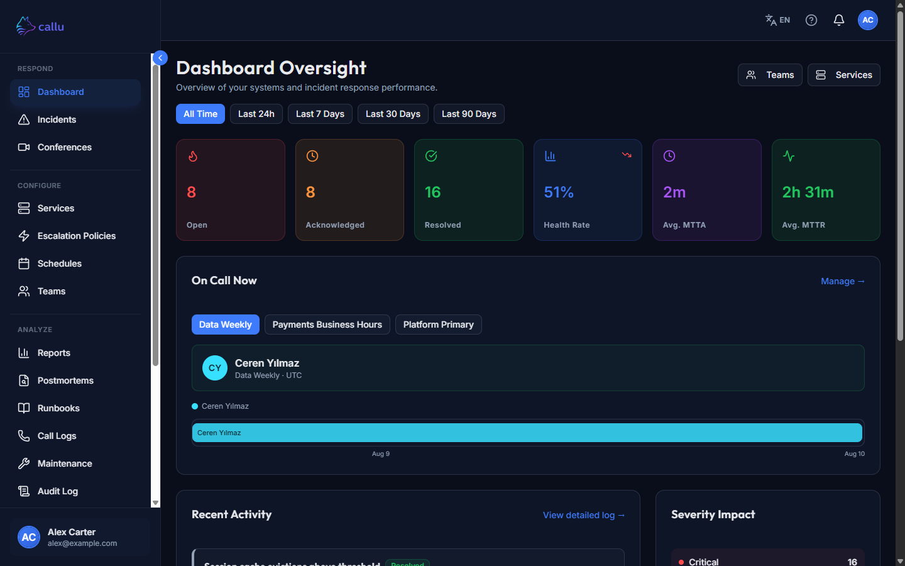
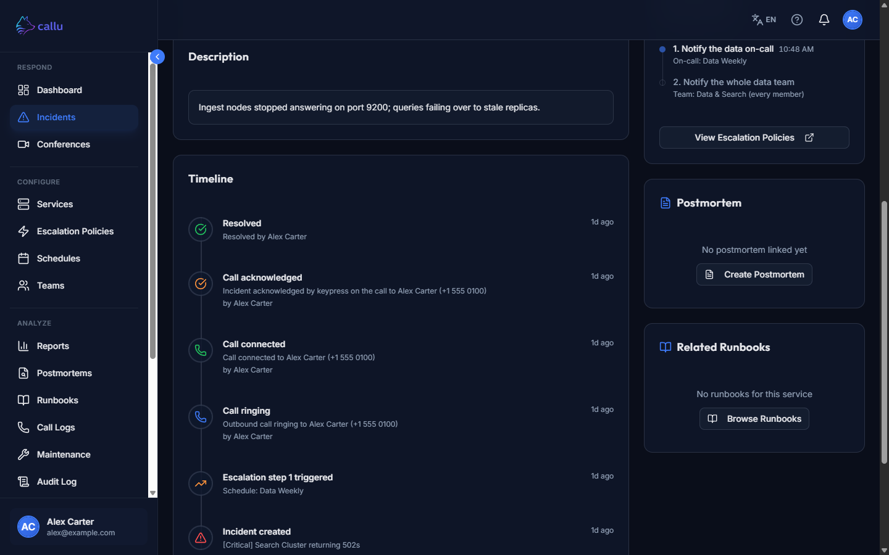
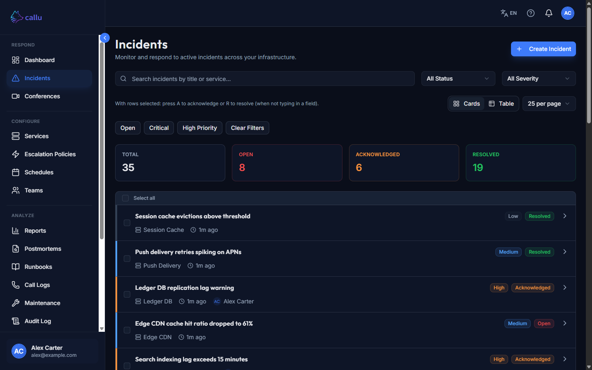
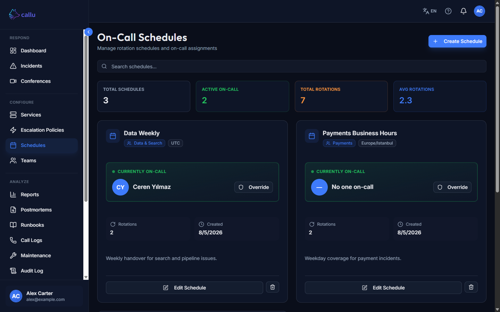
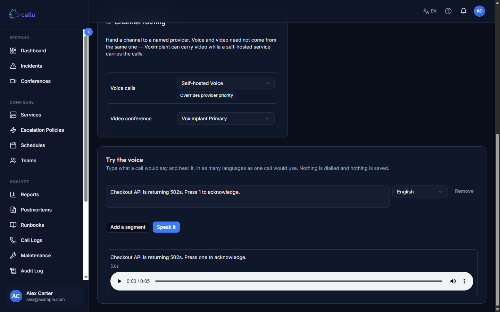

# Callu

Self-hosted incident management and on-call scheduling. Single-tenant: one deployment per organization, you own the data.

Stack: .NET 10, React 19, PostgreSQL, with optional Redis and RabbitMQ.

**Website:** [callu.app](https://callu.app) · **User guide:** [callu.app/docs](https://callu.app/docs) · **Operator docs:** [callu.app/docs/technical](https://callu.app/docs/technical)



<details>
<summary><strong>More screenshots</strong> — incidents, paging timeline, schedules, voice preview</summary>

An incident's timeline records the whole paging chain — escalated, phone ringing, connected, acknowledged by keypress:



The incident list, with bulk acknowledge/resolve:



Timezone-aware on-call schedules:



The TTS preview speaks any text through the same synthesizer a real call uses — here it read "Press 1" as "Press one":



</details>

## Features

### Incident management
- Six-state lifecycle — Open → Acknowledged → Investigating → Mitigated → Resolved → Closed — with guarded transitions. Resolved/closed incidents can be reopened. Severity is Low/Medium/High/Critical.
- Per-incident append-only timeline, internal/pinned notes, manual escalate, reassign, and bulk acknowledge/resolve.
- Duplicate suppression: a second active incident with the same external alert id on the same service is rejected.
- Alert automation rules — priority-ordered rules match incident fields (severity, status, title, description, service, team) and run actions: auto-escalate, assign team or user, set severity, add a note, or suppress notifications. Rules evaluate against an incident only after it is created (not on update, and not against raw webhook payloads), so a status condition effectively matches new incidents only.
- Postmortems per incident with a Draft → In review → Published → Locked workflow and follow-up action items.
- Runbooks (Markdown) optionally linked to a service, with tags and usage tracking.

### Inbound integrations (webhooks)
- Per-service webhook endpoint authenticated by an API key, with optional HMAC-SHA256 signature verification. Bodies are capped and the endpoint is rate-limited per IP.
- Listening/capture mode records incoming requests (sensitive headers redacted, body trimmed) for inspection instead of creating incidents; a capture can be promoted into a template.
- JSONPath payload templates map external alerts to incident fields and open/resolve events. Built-in templates ship for Prometheus Alertmanager, Grafana Alerting, and generic JSON.
- Outbound acknowledgement webhooks per service, delivered with retries.

### On-call scheduling & escalation
- Timezone-aware schedules using NodaTime. Rotations are wall-clock templates in the schedule's IANA zone, pre-expanded into concrete UTC occurrence rows (30-day horizon) so on-call lookups are simple range scans — no recurrence math at query time.
- Recurrence: none, daily, weekly, biweekly, monthly, or a custom day interval, with an optional end date.
- Explicit DST policy: spring-forward gaps shift to the next valid instant; fall-back ambiguities take the earlier mapping. Shifts are wall-clock, so transition days span 23 or 25 hours of real time.
- Manual overrides stored as absolute UTC instants, so "cover for me from 17:00 Friday my time" resolves unambiguously.
- Escalation policies with ordered steps; each step targets an explicit user list, a schedule (page the on-call), or a team (whole team or on-call only). A background process advances unacknowledged incidents step by step — paging first and committing the advance only afterwards, so a crash re-pages rather than skips a step (at-least-once), enforcing a minimum inter-step delay, and recording an event when a step reaches nobody or the policy is exhausted.

### Notifications
- Per-user delivery over email, SMS, voice call, and in-app / mobile push, governed by per-user preferences. Email and SignalR push default on; SMS and voice are opt-in. Optional **Firebase Cloud Messaging** uses a customer-owned service account (Settings → Firebase, or `PUT /api/v1/settings/firebase`); native clients register tokens with `POST /api/v1/devices/push` after login and unregister with `POST /devices/push/unregister` (or `DELETE`). Push is never counted as a paging channel — escalation still needs email, SMS, or voice.
- Timezone-aware quiet hours, bypassed for escalation pages. Failed deliveries retry with exponential backoff and are de-duplicated.
- Organization notification channels — Slack, Microsoft Teams, a custom webhook, or a shared email address — fire on incident created, acknowledged, resolved, closed and reopened (each event toggled per channel; only "created" is on by default), filtered by minimum severity and an optional service allowlist, with their own retry ladder.

### Voice & video
- Voice paging through either a cloud provider or [callu-voice](https://github.com/orchesta/callu-voice), a self-hosted Asterisk + local-TTS container whose only outside party is your SIP carrier — no telephony account, no incident text leaving your infrastructure. The SIP trunk you assign to it in Callu is pushed to the voice service, and pushed again when that service restarts empty; a page the provider accepted but never reported a call for is flagged on the incident timeline and in the audit log within minutes.
- Each channel is routed to a named provider (Settings → Communications → Channel routing), so voice and video need not come from the same place — video can stay on Voximplant while a self-hosted service carries the calls.
- Cloud voice calls and WebRTC video rooms through [Voximplant](https://voximplant.com/). VoxEngine scenarios are uploaded to your account by the **Provision** action on the Voximplant provider page (Settings → Communications → Voximplant) — saving credentials does not provision on its own. Re-provision after any upgrade that ships new scenarios; the page flags a provisioned script older than the one this version expects.
- Per-incident conference rooms with per-participant join links (reusable for re-join), a participant cap, and auto-expiry. Joining rotates that participant's Voximplant user password to a fresh random value and hands it to the browser for the Web SDK login, so your SIP trunk password never reaches the browser. It is not a one-time key — Voximplant exposes no one-time-login API — so it stays valid until the next join rotates it again. When an SMS provider is configured, team members with a phone number are texted a join link.
- Per-language text-to-speech templates (English and Turkish built in) for call prompts. With the self-hosted voice service connected, a preview renders a saved template — or any text you type — through the same synthesizer a real page uses and plays it in the browser, so a wrong reading is audible before a phone rings. (Cloud providers cannot preview: their synthesis runs only inside a live call.)
- SIP trunk management with credentials encrypted at rest. Call logs per incident, recording the provider's stated reason when a call fails.

### Service catalog & status
- Service catalog with a dependency graph. Status changes cascade to dependents by criticality (worsenings only; recovery is cleared manually) and can optionally open incidents.
- HTTP health checks per status-page component, with a consecutive-failure threshold before a component flips status. Probe URLs are SSRF-checked (resolve to public IPs only, no redirects).
- Public status pages with components, operator-posted incidents and updates, day-by-day uptime, and double-opt-in email subscribers. Public responses strip internal probe configuration.
- Maintenance windows over an absolute UTC interval, in two modes: suppress incoming alerts, or auto-acknowledge them.

### Reporting
- Dashboard summary (status and severity counts, MTTA/MTTR, recent incidents) with incident-trend, MTTA/MTTR, and worst-uptime widgets.
- Reports: incident trends, MTTA/MTTR over time, per-service uptime, team performance, and severity distribution.

### Identity & access
- First-run wizard creates the initial administrator; the endpoint self-disables once an admin exists.
- Invitation-only onboarding — there is no open signup. Admins invite users by email; invitees set their own password via an emailed link.
- Claim-based RBAC with four roles (Admin, TeamLead, Member, Viewer). Team membership also records a Lead/Member/Observer label per member — descriptive today; it does not affect authorization or who gets paged (paging a team notifies every member).
- JWT access tokens with rotating refresh tokens and family-based reuse detection, plus per-token revocation and a security-stamp check — so role changes, user removal, and password resets invalidate live sessions immediately. The browser SPA keeps the refresh token in an HttpOnly cookie. Native clients send `X-Callu-Client: native` to also receive `refreshToken` in the JSON body (for the platform keychain). `POST /api/v1/auth/refresh` accepts the cookie or `{ "refreshToken" }` (cookie wins if both are present). Body logout revokes that login family only; Bearer logout revokes every session.
- Password policy, account lockout, and per-IP rate limiting on auth (and other sensitive) endpoints. An audit log records key domain mutations (incident state changes, service and status-cascade changes, escalation outcomes, runbook and postmortem edits) plus Login / Logout / LoginFailed, RoleAssigned and organization SettingsChanged; it does not yet cover invite/remove user, password change, or team membership administration. It is readable under **Audit Log** in the sidebar and over the API, filtered and paginated, with a tamper-evident hash chain you can verify on demand. Entries record the request, trace and logical-operation identifiers they were written under, so an audit row can be matched to its trace in Diagnostics; JSON Lines exports can optionally be Ed25519-signed (`Callu:AuditSigning`), with the public keys listed at `GET /api/v1/audit-logs/signing-keys`. Its JSON Lines export is shaped as an [OpenAuditModel](https://github.com/OpenAuditModel/OpenAuditModel) v0.1 event — OpenAuditModel is itself an experimental, spec-v0.1 open schema for audit events (Apache 2.0), so read this as "shaped like," not "certified against."
- Invitation emails need SMTP. When the mail cannot go out, Invite / Resend still creates (or refreshes) the account and shows a copyable invite link in the UI.

### Operations
- Single Docker Compose stack. Database migrations run automatically on startup, guarded by a Postgres advisory lock so the API and Worker don't race.
- API/Worker split for background jobs; Redis and RabbitMQ are optional. OpenTelemetry traces export to the bundled Jaeger (metrics are also emitted over OTLP but need a metrics-capable collector to view — Jaeger stores traces only).
- **Diagnostics page** (`/diagnostics`, Admin only) reads those traces through the API, so you follow a request across the API, database, broker, Worker jobs and outbound providers using your normal Callu login. Traces are grouped by operation with count/average/p95, and each one opens as a span waterfall. Jaeger's own UI has no authentication, which is why its port is not published and this page is the way in. Traces are kept for `JAEGER_TRACE_TTL` (default 72h) — a debugging aid, not an audit trail.
- Provider, SMTP, and SIP secrets are encrypted at rest with ASP.NET Data Protection. SMTP and communication providers are configured in-app after first login, not through environment variables.
- English and Turkish UI translations, with an in-app language switcher in the authenticated header and on the public status page. The preference is client-side (stored in the browser). API messages follow the request's `Accept-Language`, falling back to English for any other language; adding one is a `*.json` file next to the two in `Callu.Api/Resources/Locales/`. Text the Worker produces (notification bodies) is English, because a scheduled job has no request to read a language from.

## Quick start

Requires [Docker](https://www.docker.com/) and Docker Compose.

```bash
git clone https://github.com/orchesta/callu.git
cd callu
cp .env.example .env
```

Edit `.env` and set the four secrets Compose refuses to start without: `POSTGRES_PASSWORD`, `RABBITMQ_PASS`, `REDIS_PASSWORD`, and `JWT_SECRET_KEY`. Generate each one — don't copy a value out of any document, including this one. `JWT_SECRET_KEY` must be at least 32 bytes, and the API rejects well-known example keys outright:

```bash
openssl rand -hex 24     # POSTGRES_PASSWORD
openssl rand -hex 24     # RABBITMQ_PASS
openssl rand -hex 24     # REDIS_PASSWORD
openssl rand -base64 48  # JWT_SECRET_KEY
```

Paste each into the matching (empty) line in `.env`. `-hex` keeps the three passwords free of commas and spaces, which the Redis and Postgres connection strings would otherwise have to escape.

Everything else has sensible defaults (see [`.env.example`](.env.example) for the full set). Then:

```bash
docker compose up -d
```

Open `http://localhost:3000`. The first visit routes to the setup wizard to create the administrator account. After logging in, configure SMTP (Settings → SMTP) and your voice/SMS providers (Settings → Communications) — these live in the database, not in `.env`.

The stack is seven long-running services: PostgreSQL, Redis, RabbitMQ, Jaeger (internal OTLP), the .NET API, the worker, and the React SPA behind nginx. An eighth container, `callu-jaeger-init`, prepares the trace volume and exits; `docker compose ps -a` shows it as `Exited (0)`, which is success.

**Ports.** Only `3000` (web) is published on all interfaces. The Jaeger UI (`16686`) and the RabbitMQ management UI (`15672`) are both bound to loopback, so from the host they are at `http://127.0.0.1:16686` and `http://127.0.0.1:15672` (RabbitMQ credentials from `RABBITMQ_USER` / `RABBITMQ_PASS`) and are not reachable from the LAN. OTLP gRPC (4317) stays on the internal network.

**Images.** `docker compose up -d` pulls the published images (`orchestalabs/callu-api`, `callu-worker`, `callu-web`) at a pinned tag — no source tree or SDK needed. To build from your local `./src` instead, add the dev overlay explicitly (it is not auto-merged):

```bash
docker compose -f docker-compose.yml -f docker-compose.dev.yml up -d --build
```

**Behind a reverse proxy or CDN.** Callu serves a strict `Content-Security-Policy` that allows scripts from its own origin only. Proxies and CDNs that rewrite HTML — Cloudflare's Web Analytics, Rocket Loader and Email Obfuscation, and the equivalent features elsewhere — inject a `<script>` into every page; the browser refuses to run it and logs a CSP violation on each load. Nothing in Callu breaks, but the injected analytics does not work and the console fills with errors, so turn those features off for the hostname rather than widening the policy. Callu itself sends no telemetry to us: the OpenTelemetry traces go to the Jaeger container inside your own stack.

Set `CORS_ORIGINS` and `CALLU_PUBLIC_URL` to the public HTTPS URL, and forward `X-Forwarded-For` / `X-Forwarded-Proto` — `ForwardedHeaders:KnownNetworks` / `KnownProxies` decide which hops are trusted. HSTS is off in effect until you raise `HSTS_MAX_AGE_SECONDS` (default 300 seconds, deliberately short) — while it is in force a browser will not fall back to HTTP, so an expired or misissued certificate makes the site unreachable for exactly that long.

**Telemetry.** Set `OPEN_TELEMETRY_ENABLED=false` in `.env` to disable export. For local `dotnet run` without Docker, either set `OTEL_EXPORTER_OTLP_ENDPOINT` or set `OpenTelemetry:OtlpEndpoint` in config.

**Worker vs API.** The Worker is required: every scheduled job (escalation dispatch, notification retries, schedule materialization, health checks, voice/webhook retries, conference/token cleanup, retention pruning) runs there via Quartz — the API schedules none of them. (Both hosts do run two small self-healing loops: a notification reaper and a provider-registry refresh.) New incidents publish `TriggerIncidentEscalation` to RabbitMQ when `RabbitMQ:Host` is set; when it is empty the API performs the first dispatch in its own process via `DirectEscalationWorkflowSignal`, deferred until the incident transaction commits, and the Worker's Quartz sweep advances the later steps.

**Health endpoints.** `GET /health` is the container/readiness probe. It runs only the checks whose failure means the API itself cannot serve — today the database. `GET /health/detail` returns a JSON report for every check, including the optional dependencies (SMTP relay, cached 60 s; Redis), each with its status, duration and failure reason. With a broker configured it also reports `messaging-backlog`: how many messages are waiting to be published, how many were given up on, and the same two for the consuming side. Those counts never change any status — they are there so "the broker is up but nothing is being delivered" is a number you can read rather than a silence.

Point orchestrator probes at `/health`, never `/health/detail`: an unreachable mail relay or a Redis blip is a degraded feature, not a reason to take the deployment out of rotation — and `callu-web` waits for `callu-api` to be healthy before it starts, so a probe that fails on an optional dependency would keep the whole UI down. nginx does not proxy `/health/detail` (it names your dependencies and why they failed); read it from the host with `docker exec callu-api curl -s localhost:5095/health/detail`.

The Worker serves its own probes on `Worker:HealthPort` (default `8080`), and they are named differently: `GET /health/live` answers whenever the process is up, and `GET /health/ready` — what Compose probes — fails on the database or a Quartz scheduler that is not running, while reporting the broker and Redis without ever failing on them. There is no `/health` or `/health/detail` on the Worker.

### Redis, secrets and durable state

The bundled Redis starts with `requirepass`, and the API/Worker connection string is assembled by Compose from `REDIS_HOST` / `REDIS_PORT` / `REDIS_PASSWORD`. Set `REDIS_PASSWORD` in `.env` (`openssl rand -hex 24`) before the first `docker compose up -d` — Compose refuses to start while it is empty.

`REDIS_PASSWORD` must not contain a comma or a space — a Redis connection string separates options with `,` and offers no escape, so part of the password would be parsed as a second server. For an external Redis that these variables cannot express (no password, an ACL user, an awkward password), set `REDIS_CONNECTION_STRING` to a full connection string; it overrides `REDIS_HOST` / `REDIS_PORT` / `REDIS_PASSWORD` / `REDIS_EXTRA_OPTIONS` for both the API and the Worker.

Do not add `--appendonly yes` to the Redis service. An existing `callu_redis_data` volume holds an RDB snapshot only; a Redis that boots with AOF enabled and finds no AOF file ignores `dump.rdb` and starts empty, which discards the `callu:dp-keys` key ring — the stored SMTP and SIP passwords then no longer decrypt, and every session, invitation and reset token is invalidated. If you want AOF, enable it on the running container (`CONFIG SET appendonly yes`, then `CONFIG REWRITE`), which rewrites the AOF from the live dataset.

`callu_redis_data` is durable state, not a cache — back it up and do not prune it.

**If you use Voximplant, provision the scenarios before relying on phone acknowledgement.** A phone acknowledgement is bound to the incident the call was placed for: the call-data response carries a short-lived `callback_token`, and the VoxEngine script returns it as `X-Call-Token`. The scenario in your Voximplant account is not created automatically — until you provision it (Settings → Communications → Voximplant → Provision), a script that sends no token has its acknowledgements rejected with 401, so escalation keeps paging people who already acknowledged by phone. Acknowledging from the web UI is unaffected. `Voximplant:AllowLegacyUnboundCallbacks=true` (`VOXIMPLANT_ALLOW_LEGACY_UNBOUND_CALLBACKS=true` in `.env`) accepts unbound callbacks and logs a warning on every one; it lets anyone who can reach the callback endpoint acknowledge any incident, so leave it off unless you are debugging a scenario.

### Backup & restore

Two things must be backed up and restored **together, and from the same moment**: the PostgreSQL database and the Data Protection key ring. The database stores SMTP and SIP passwords, webhook secrets, and notification-channel secrets encrypted at rest; the key ring is the only thing that decrypts them.

**A split restore does not fail loudly.** The stack boots, migrations run, and every incident, schedule and user is where you left it — while every encrypted secret is unreadable. Email and voice paging stop, notification channels stop, and every session, invitation and reset token is already invalid. Nothing in the UI says so, and you find out the next time an incident needs to page someone. Restore both, or neither.

**Where the key ring is.** With the bundled Compose stack it is in **Redis**: Compose always sets `ConnectionStrings__Redis`, so the key ring is the `callu:dp-keys` entry inside the `callu_redis_data` volume, and `callu_dpkeys` is empty on such an install. `callu_dpkeys` (mounted at `/app/keys` on `callu-api` and `callu-worker`) holds the key ring **only** if you removed the `callu-redis` service or left `ConnectionStrings:Redis` empty — see [the filesystem fallback](#fallback-the-filesystem-key-ring) below. Back up whichever one your install actually uses; an empty `callu_dpkeys` and an empty Redis look identical to a backup script, so check which has content.

Keep your `.env` with the backup: `POSTGRES_PASSWORD`, `REDIS_PASSWORD` and `JWT_SECRET_KEY` live in no volume, and restoring with a different `JWT_SECRET_KEY` logs everybody out.

Compose prefixes volume names with the project name — the directory you run it from, so `callu_callu_redis_data` and `callu_callu_pgdata` by default; `docker volume ls` shows the real names. The commands below mount volumes with `--volumes-from <container>` so they stay correct whatever that prefix is.

#### Backup

```bash
# 1. database — logical dump, safe while the stack runs
docker exec callu-db sh -c 'pg_dump -U "$POSTGRES_USER" -d "$POSTGRES_DB" -Fc' \
  > callu-db-$(date +%F).dump

# 2. key ring — stop Redis so its on-disk snapshot is current, archive /data, start it again
docker compose stop callu-redis
docker run --rm --volumes-from callu-redis -v "$PWD":/backup alpine \
  tar czf /backup/callu-redis-$(date +%F).tgz -C /data .
docker compose start callu-redis

# 3. confirm the archive is not empty — it must list ./dump.rdb
tar tzf callu-redis-$(date +%F).tgz
```

Step 2 stops Redis deliberately. Persistence here is RDB snapshots on the image's save rules, so a `tar` taken while Redis runs can capture a `dump.rdb` that is hours old — and an hours-old key ring is exactly the failure this section is about. Redis writes a final snapshot on `SIGTERM`, so a graceful `docker compose stop` leaves the file current. The API and Worker ride out the gap (the connection is `AbortOnConnectFail=false` and the key ring is already in memory), but don't save settings or invite users while it is down.

Take the dump and the snapshot minutes apart, not days: a secret encrypted after your key-ring snapshot cannot be decrypted from it. The key ring gains an entry on first start and on rotation (365-day key lifetime), so pairing a stale key-ring archive with a fresh dump is a real way to lose only the secrets changed in between — the worst case to debug.

If you cannot stop Redis, force a fresh snapshot first, then archive `/data` with the container running:

```bash
docker exec callu-redis sh -c 'redis-cli --no-auth-warning -a "$REDIS_PASSWORD" BGSAVE'
```

(Reading `REDIS_PASSWORD` inside the container keeps it out of your host shell history.)

#### Restore

Order matters: nothing that decrypts or encrypts may start before the key ring is back. If the API starts first it mints a **new** key ring, and the restored database's encrypted columns are then unrecoverable.

```bash
# 1. database only — callu-db has no dependencies, so this starts nothing else
docker compose up -d callu-db

# 2. restore the dump ("does not exist, skipping" notices are normal on a fresh database)
docker exec -i callu-db sh -c 'pg_restore -U "$POSTGRES_USER" -d "$POSTGRES_DB" --clean --if-exists' \
  < callu-db-YYYY-MM-DD.dump

# 3. create the Redis container WITHOUT starting it, so it cannot write an empty snapshot
docker compose create callu-redis

# 4. replace its /data with the archived snapshot (restore the whole directory, not just dump.rdb)
docker run --rm --volumes-from callu-redis -v "$PWD":/backup alpine \
  sh -c 'rm -rf /data/* && tar xzf /backup/callu-redis-YYYY-MM-DD.tgz -C /data'

# 5. start Redis and confirm the key ring loaded — this must print 1
docker compose start callu-redis
docker exec callu-redis sh -c 'redis-cli --no-auth-warning -a "$REDIS_PASSWORD" EXISTS callu:dp-keys'

# 6. only now bring up the rest
docker compose up -d
```

If step 5 prints `0`, stop there and do not run step 6 — the key ring did not load, and starting the API is what makes the loss permanent. Re-check the archive (`tar tzf`) and that step 4 extracted into the volume Redis actually mounts.

Restore the same `.env` you backed up.

#### Verify the restore before you trust it

`EXISTS` proves *a* key ring is present, not that it is *yours*. Prove it decrypts the data you just restored:

1. Log in and open **Settings → SMTP**, then click **Test Reachability**. `Stored SMTP password could not be decrypted. Re-enter your password in the settings.` means the key ring does not match the database — the restore failed, however healthy the rest of the UI looks. (Scripted equivalent: `POST /api/v1/settings/smtp/test-connection` as an Admin.)
2. Then **Send Test Email** and check it arrives. Reachability proves the stored password decrypted; only a real send proves it is still the password the relay accepts.
3. Repeat with a provider test under **Settings → Communications** — SIP and provider secrets use the same key ring, so they fail the same way.

Note that a failed **Test Reachability** also marks SMTP not-configured until you re-save the password, so email dispatch then *skips* instead of erroring — run this check deliberately rather than meeting it during an incident.

There is no recovery from a lost key ring. Re-enter the SMTP password, SIP trunk passwords, provider credentials and notification-channel secrets by hand; everyone logs in again.

#### Fallback: the filesystem key ring

Only if you removed the `callu-redis` service or left `ConnectionStrings:Redis` empty. The key ring is then XML files in `callu_dpkeys`:

```bash
# backup — safe while running (files change on key rotation only)
docker run --rm --volumes-from callu-api -v "$PWD":/backup alpine \
  tar czf /backup/callu-dpkeys-$(date +%F).tgz -C /app/keys .

# restore — before callu-api has ever started, then continue with `docker compose up -d`
docker compose create callu-api
docker run --rm --volumes-from callu-api -v "$PWD":/backup alpine \
  sh -c 'rm -rf /app/keys/* && tar xzf /backup/callu-dpkeys-YYYY-MM-DD.tgz -C /app/keys'
```

The same "verify before you trust it" steps apply.

## Upgrading

Migrations are **forward-only** and run automatically when the API (and Worker) start. There is no
supported downgrade path.

```bash
docker compose pull
docker compose up -d
```

What to expect:

- **Schema** — EF applies pending migrations under a Postgres advisory lock. Jumping several
  versions at once is supported; wiping the database is not part of an upgrade.
- **Data Protection key ring** — back up Redis `callu:dp-keys` (or the `callu_dpkeys` volume if you
  run without Redis) **with** the database. Restoring the DB alone leaves provider secrets and the
  audit-chain key undecryptable.
- **Worker** — always run `callu-worker` alongside the API. Background paging, retries and the audit
  seal/verify jobs live there, not on the API.
- **Which build?** — Diagnostics (Admin) shows `version` + `informationalVersion` for the running
  API. After a release, registry digests are recorded in the CHANGELOG so a republished tag is
  distinguishable.

Re-provision Voximplant scenarios after upgrades that ship new scripts (Settings → Communications →
Voximplant → Provision).

## Tech stack

**Backend:** .NET 10, ASP.NET Core, EF Core, PostgreSQL, ASP.NET Identity, JWT. NodaTime for timezone math. Redis + RabbitMQ are optional. The transactional outbox on the API and the consumer inbox on the worker are written in this repository on the RabbitMQ client, both backed by EF Core. SignalR for real-time push. Quartz.NET for worker scheduling. ASP.NET Data Protection for secret-at-rest encryption. Serilog for logging, OpenTelemetry for traces/metrics.

**Frontend:** React 19, TypeScript, Vite, Tailwind CSS 4, Radix UI, TanStack Query.

## Architecture

Clean Architecture, four backend layers plus a shared DTO library and the SPA:

```
src/
  Callu.Domain/          Entities, enums, base types
  Callu.Application/     Service + repository contracts, messaging contracts
  Callu.Infrastructure/  EF Core, Identity, messaging, Quartz, providers
  Callu.Shared/          DTOs, Result<T>, localization
  Callu.Api/             ASP.NET Core host (controllers, middleware, SignalR hub)
  Callu.Worker/          Background host (Quartz jobs, message handlers)
  Callu.Web/             React SPA (feature-based layout)
```

Both hosts share `Callu.Infrastructure`. They're wired for different responsibilities via `CalluMessagingHostRole` (`ApiPublisher` vs `WorkerConsumer`) and `CalluTelemetryHostKind` (`Api` vs `Worker`). Both run EF migrations at startup under a shared advisory lock, and both must share the same Data Protection key ring — Redis (`callu:dp-keys`) with the bundled Compose stack, the `callu_dpkeys` volume only if you run without Redis — so secrets written by one host decrypt on the other.

### Backend conventions
- Controllers are thin; they use policy-based `[Authorize]` and return `IActionResult`. An `ApiResponseWrapperFilter` wraps responses in `ApiResponse<T>`. FluentValidation runs via a filter. Services throw domain exceptions, which a global exception handler maps to the right status code; `Result<T>` is a secondary pattern used inside the service layer (`IServiceManagementService`), not a controller return type.
- Repositories are generic `IRepository<T>` plus per-entity specializations.
- `HybridCache` is the caching abstraction. Setting `ConnectionStrings:Redis` enables L2 and the SignalR Redis backplane.
- Audit fields (`CreatedAt`, `CreatedBy`, `UpdatedAt`, `UpdatedBy`) on every `BaseEntity` are populated automatically. Soft-delete is enforced through EF global query filters.

### Frontend conventions
Feature-sliced under [`src/Callu.Web/src/features/`](src/Callu.Web/src/features/); each feature has `api/`, `hooks/`, `types/`, `components/`, and an `index.ts` barrel. Cross-cutting code lives in [`src/shared/`](src/Callu.Web/src/shared/). API calls go through a typed `apiClient` that unwraps the `ApiResponse<T>` envelope. Data fetching uses `useApiQuery` / `useApiMutation` over TanStack Query with hierarchical keys.

## Local development

**Prerequisites:** [.NET 10 SDK](https://dotnet.microsoft.com/download), [Node.js 20+](https://nodejs.org/), PostgreSQL 16 (the version the bundled stack and the test suite both use).

### Backend

Both `appsettings.Development.json` and `Properties/launchSettings.json` are gitignored, so a fresh clone runs in the `Production` environment on Kestrel's default port unless you say otherwise. The committed `appsettings.json` is the template: copy it, fill in the connection string and a signing key, then set the two environment variables the Docker image otherwise sets for you:

```bash
cd src
cp Callu.Api/appsettings.json Callu.Api/appsettings.Development.json
# edit that copy: ConnectionStrings:DefaultConnection and JwtSettings:SecretKey (≥ 32 bytes)

export ASPNETCORE_ENVIRONMENT=Development     # loads appsettings.Development.json
export ASPNETCORE_URLS=http://localhost:5095  # the port the SPA's VITE_API_URL expects

dotnet restore
dotnet ef database update --project Callu.Infrastructure --startup-project Callu.Api
dotnet run --project Callu.Api
```

The API then listens on `http://localhost:5095`. (PowerShell: `$env:ASPNETCORE_ENVIRONMENT = "Development"`, `$env:ASPNETCORE_URLS = "http://localhost:5095"`.) If you prefer, create your own `src/Callu.Api/Properties/launchSettings.json` with the same two values — it stays local, which is why the repo does not ship one.

To run the worker in a separate process (matches the Docker topology), start it after Redis is up if you use `ConnectionStrings:Redis`:

```bash
export ConnectionStrings__DefaultConnection="Host=localhost;Port=5432;Database=calludb;Username=callu;Password=..."
dotnet run --project Callu.Worker
```

The worker reads the same configuration keys but ships no development config file of its own, so pass its connection string (and anything else it needs) through the environment as above.

The API schedules no periodic jobs — always run a `Callu.Worker` alongside it, in local development too (`dotnet run --project Callu.Worker` in a second terminal). Without the Worker, escalation paging, retries, cleanup and conference expiry never run.

Callu.Worker schedules periodic work with [Quartz.NET](https://www.quartz-scheduler.net/): escalation dispatch (every 10s), notification retries (10s), health checks (15s), voice-call retries (15s), conference-room expiry (60s), webhook-delivery retries (60s), notification-channel retries (60s), refresh-token cleanup (daily 02:00 UTC), schedule materialization (daily 03:00 UTC), and a retention prune (daily 04:00 UTC, which deletes nothing until you set a window under `Callu:Retention` — every window defaults to 0, meaning keep forever). The intervals are fixed in code. The default job store is in-memory (`Quartz:UsePersistentStore = false`). **Run exactly one Worker with that default** — a second replica fires every job twice (pages, retries, seals). For clustered workers, set `UsePersistentStore` to `true` and create the `qrtz_*` tables from the upstream [tables_postgres.sql](https://github.com/quartznet/quartznet/blob/main/database/tables/tables_postgres.sql). With Redis configured, a second in-memory Worker also logs a lease Warning at runtime.

### Frontend

```bash
cd src/Callu.Web
cp .env.example .env.local
npm install
npm run dev
```

Runs at `http://localhost:3000`. All three variables are optional and fall back to a default, but set `VITE_API_URL` for local development (`http://localhost:5095`) — left unset the SPA calls its own origin, which is right behind nginx and wrong here. The other two, `VITE_AUTH_TOKEN_KEY` and `VITE_API_TIMEOUT`, can stay as they come.

## Configuration

In Docker, settings come from environment variables (double-underscore form, e.g. `ConnectionStrings__Redis`). [`.env.example`](.env.example) is the full reference; the table below lists the settings that matter most. For local `dotnet run`, the same keys live in `appsettings.json` in colon form.

**Backend:**

| Setting | Purpose |
|---|---|
| `ConnectionStrings:DefaultConnection` | PostgreSQL connection string |
| `ConnectionStrings:Redis` | Optional Redis. Enables HybridCache L2, the SignalR backplane, and the Data Protection key ring. When empty, cache stays in-process, SignalR is single-host, and keys go to the local filesystem. In Docker this is assembled by Compose from `REDIS_HOST` / `REDIS_PORT` / `REDIS_PASSWORD` (+ optional `REDIS_EXTRA_OPTIONS`), or taken verbatim from `REDIS_CONNECTION_STRING` when that is set. Reported on `/health/detail` as `redis` — the connection is made with `AbortOnConnectFail=false`, so without that check a wrong password (NOAUTH) would be invisible |
| `RabbitMQ:Host` / `Port` / `Username` / `Password` / `VirtualHost` | Optional broker. With `Host` set, the API stages messages in the same transaction as the domain write and publishes them from `OutboxEntries`; the Worker dedupes and consumes them through `InboxEntries`. A broker outage is reported on `/health/detail` as `rabbitmq`, and the undelivered counts as `messaging-backlog`; neither fails readiness, because the messages wait in the outbox. Empty host keeps escalation in-process |
| `Quartz:UsePersistentStore` | Worker only. `false` (default) = in-memory; **exactly one Worker**. `true` = clustered ADO job store on `DefaultConnection` (`qrtz_*` tables). `true` with an empty `DefaultConnection` is refused at startup rather than run: falling back to the in-memory store would give each worker its own scheduler, so every job would fire once per worker. In-memory mode logs a startup Warning always, and a Redis TTL lease Warning if a second replica appears |
| `Callu:Retention:NotificationDays` / `AuditLogDays` / `WebhookCaptureDays` / `CallLogDays` / `StatusPageViewDays` / `IncidentTimelineEventDays` | Worker only. Days to keep each table; `0` (default) keeps rows forever. In Docker these are `RETENTION_NOTIFICATION_DAYS`, `RETENTION_AUDIT_LOG_DAYS`, `RETENTION_WEBHOOK_CAPTURE_DAYS`, `RETENTION_CALL_LOG_DAYS`, `RETENTION_STATUS_PAGE_VIEW_DAYS` and `RETENTION_INCIDENT_TIMELINE_EVENT_DAYS`. The prune runs daily at 04:00 UTC, deletes in batches, and does nothing while all six are `0` |
| `JwtSettings:SecretKey` / `Issuer` / `Audience` | Signing key (≥ 32 bytes, required) plus issuer/audience. The API refuses to start if these are missing or too short |
| `JwtSettings:AccessTokenExpirationMinutes` / `RefreshTokenExpirationDays` | Token lifetimes. Defaults are 15 min and 7 days, in `appsettings.json` and in the Docker stack alike (`JWT_ACCESS_TOKEN_MINUTES` / `JWT_REFRESH_TOKEN_DAYS`) |
| `Cors:AllowedOrigins` | Browser origins allowed to call the API with credentials |
| `Callu:Security:HstsMaxAgeSeconds` / `HstsIncludeSubDomains` / `HstsPreload` | `Strict-Transport-Security`, honoured by browsers over HTTPS only. Default `300` seconds with neither flag: while HSTS is in force the browser refuses plain HTTP, so a long value strands users on an install whose certificate later breaks, and `preload` is close to permanent. `0` removes the header. In Docker these are `HSTS_MAX_AGE_SECONDS`, `HSTS_INCLUDE_SUBDOMAINS` and `HSTS_PRELOAD`; nginx sends its own matching header for the SPA |
| `CalluSettings:ApiUrl` | Fallback public base URL for links in invitation, reset and conference-invite emails, and for the callback URL written into the Voximplant scenarios. The Base URL saved under Settings → Organization takes precedence over it |
| `CommunicationSettings:AllowPrivateSmsEndpoint` | `false` (default): the generic HTTP-SMS client only calls gateways that resolve to a public IP, so it cannot be pointed at internal services or cloud metadata. Set `true` (`ALLOW_PRIVATE_SMS_ENDPOINT` in Docker) when your SMS gateway genuinely lives on the LAN — otherwise those sends are refused |
| `Voximplant:AllowLegacyUnboundCallbacks` | `false` (default): a Voximplant callback that carries no incident binding is rejected. `true` (`VOXIMPLANT_ALLOW_LEGACY_UNBOUND_CALLBACKS` in Docker) accepts it and warns — a temporary aid for upgrading with calls in flight. While on, a leaked scenario key can acknowledge *any* incident. API only; the Worker has no callback endpoint |
| `OpenTelemetry:Enabled` / `OtlpEndpoint` | Master switch and OTLP gRPC collector endpoint |
| `ForwardedHeaders:KnownNetworks` / `KnownProxies` | Trusted reverse-proxy CIDRs/IPs behind nginx |
| `Serilog:MinimumLevel` | Log level. `appsettings.json` ships Warning for the API and Information for the Worker; the Docker stack sets both from `LOG_LEVEL` (default Warning) |

SMTP credentials and voice/SMS provider configuration are **not** environment settings — they are stored in the database and edited in the Settings UI (passwords encrypted at rest).

**Frontend** (`.env`):

| Variable | Purpose |
|---|---|
| `VITE_API_URL` | Backend API base URL |
| `VITE_AUTH_TOKEN_KEY` | LocalStorage key for the auth token |
| `VITE_API_TIMEOUT` | Request timeout in milliseconds |

## API

All endpoints are versioned under `/api/v1/`, except the Voximplant scenario callbacks at `/api/voximplant/` — a fixed, unversioned path because the provisioned VoxEngine scripts call it. Authentication is JWT Bearer with HttpOnly refresh-cookie rotation. Each area is gated by claim-based policies; inbound webhooks and public status-page reads are anonymous.

| Area | Key endpoints |
|---|---|
| Setup | `GET /setup/status`, `POST /setup/initial` (first run only, self-disables) |
| Auth | `login`, `refresh`, `logout`, `me`, `accept-invitation`, `forgot-password`, `reset-password` |
| Users | list, get, update, `invite`, `{id}/role`, `{id}/resend-invitation`, soft delete |
| Teams | CRUD, members add/remove, member-role updates |
| Profile | get/update, `change-password`, `notification-preferences` |
| Incidents | CRUD, `acknowledge`/`resolve`/`close`/`reopen`/`escalate`, `assign`, `timeline`, `conference`, `webhook-deliveries`, `bulk/acknowledge`, `bulk/resolve`, notes CRUD |
| Alert rules | CRUD, `{id}/toggle`, `metadata` (condition fields, operators, action types) |
| Postmortems | CRUD, `by-incident/{id}`, `submit`/`reject`/`publish`/`lock` |
| Runbooks | CRUD, `by-service/{id}`, `mark-used` |
| Escalations | policies CRUD, steps CRUD, step reorder |
| Schedules | CRUD, `on-call`, `occurrences`, `coverage`, rotations CRUD, overrides CRUD |
| Services | CRUD, dependencies, and `services/{serviceId}/webhook-settings` (token/api-key regeneration, signature, listening mode, template) |
| Captures & templates | `captures` (review, purge per service) and `webhook-templates` (CRUD, `from-capture/{captureId}`, `{id}/test`) — both top-level, not nested under a service |
| Webhooks (inbound) | `POST /webhooks/{token}` with `X-Callu-Api-Key` (anonymous, rate-limited; `?apiKey=` still accepted, legacy) |
| Status pages | admin CRUD + components + incidents/updates + stats + subscribers; anonymous `slug/{slug}`, `{pageId}/uptime`, `{pageId}/subscribe`, `subscriptions/confirm`, `subscriptions/unsubscribe` |
| Maintenance windows | list, `active`, create, cancel, delete |
| Notifications | in-app inbox: list, `unread-count`, `read`, `read-all`, delete |
| Notification channels | CRUD, `toggle`, `test`, `types`, `severity-options` (Slack/Teams/Webhook/Email) |
| Providers | communication providers CRUD + `{id}/test-sms`, a read-only `capabilities` catalog, SIP trunks, TTS templates |
| Conferences | `rooms/{incidentId}` create, `rooms/{roomId}/end`, `validate`/`join`/`leave` per participant token (anonymous), admin list |
| Voximplant | management passthrough under `voximplant/management/{providerId}` (account/applications/scenarios/rules/users), provision, sync-users; plus the unversioned `/api/voximplant/` scenario callbacks |
| Call logs | list, per-incident |
| Dashboard | `summary`, `incident-counts`, `system-health` |
| Reports | `incident-trends`, `mtt-metrics`, `service-uptime`, `team-performance`, `severity-distribution` |
| Settings | `organization`, `smtp` (+ `smtp/test-connection`, `smtp/test-email`), `localization/timezones` |
| Email templates | `email-templates` CRUD + `{id}/preview` + `{id}/send-test`. An edited template overrides the built-in one for that key when the mail is sent |
| Diagnostics | `diagnostics/build` (version + informationalVersion), `diagnostics/tracing/status`, `tracing/overview`, `tracing/traces`, `tracing/traces/{traceId}` |
| Audit log | `audit-logs` (recent, by entity), `audit-logs/search` (filtered, paginated), `audit-logs/export` (CSV or [OpenAuditModel](https://github.com/OpenAuditModel/OpenAuditModel)-shaped JSON Lines), `audit-logs/verify` (replays the hash chain) |

Real-time updates are delivered over a SignalR hub at `/hubs/notifications` (per-user groups; incident, notification, and settings events).

## External services

Voice calls and video rooms use [Voximplant](https://voximplant.com/). VoxEngine scenarios (`callu-incident-call.js`, `callu-conference.js`) live in [`src/Callu.Infrastructure/Providers/Voximplant/Scripts/`](src/Callu.Infrastructure/Providers/Voximplant/Scripts/) and are uploaded to your account by the **Provision** action on the provider page — the step is explicit, not automatic on saving credentials. Provisioning needs a public base URL: a `localhost` one is refused, because Voximplant calls back from the cloud.

Scenario callbacks carry a scenario API key, a timestamp, and a single-use nonce — the backend rejects requests outside a 5-minute window or with a replayed nonce (the nonce store is distributed when Redis is configured, so it holds across API replicas). Per-call data tokens are separately one-time-use and expire after 10 minutes. Management API calls use JWT Bearer when a Service Account JSON is configured; otherwise they fall back to the legacy `api_key` parameter.

SMS is provider-pluggable through a capability registry: [Verimor](https://www.verimor.com.tr/) and a generic HTTP SMS gateway (operator-defined request template) ship out of the box, and the active provider is chosen in the Communications settings rather than hardcoded.

## License

[MIT](LICENSE)
